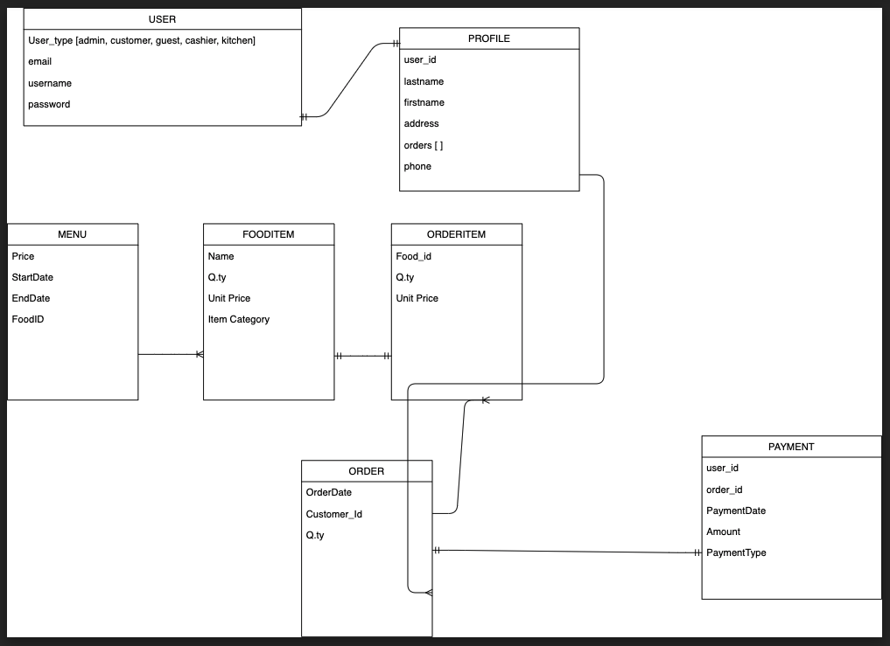
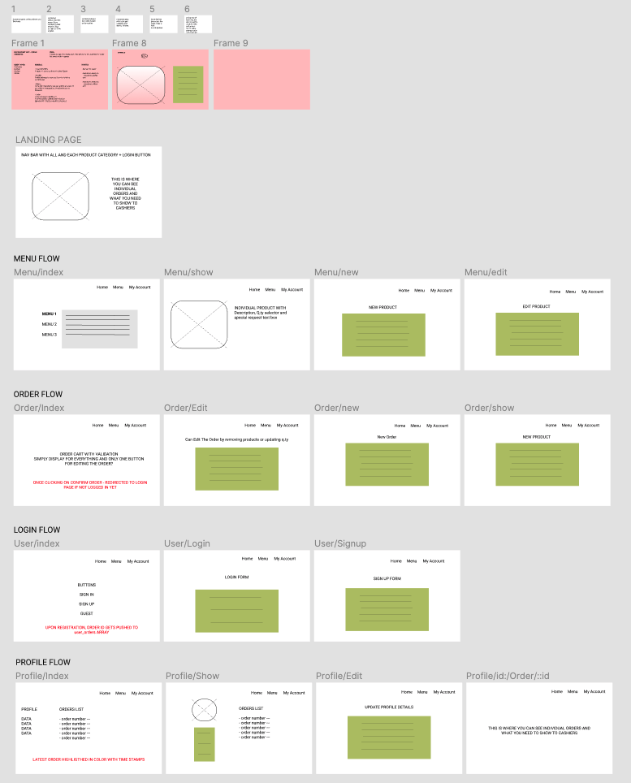

## SEI-23 Project 3 – I-Queue
An app imagined and developped by Candy Leong, Evan Yeo, Darrell Yeo and Tristan Calleja

https://i-queue.herokuapp.com/

### Pitch
Often, while waiting in line for your favorite food, you find the wait the to be neverending. How about we change that and try to speed things up so that your order is already created and you only have to pay once you (finally!) get to the counter?
Here comes the <strong>I-Queue app</strong>.
I-Queue allows you to browse through your favorite's restaurant menu and make your choice in advance.
So don't wait pointlessly anymore. Use your <strong>I-Queue</strong> for the best.

### ERD and Wireframes
ERD:

Wireframes:

### MVP
- User authentication
- User profile
- CRUD for entries
- Active Storage

### Further
- Search
- Create a cart
- Create/edit order
- Link order to profile
- Payment
- Category

### Approach & Process
- Entity Relationship Diagram (ERD) for database relationships
- Wireframes for draft user interface and experience
- Trello for project management 
- Delegation of tasks according to strengths
- Every member works on separate feature git branch
- Multi-stage testing of merged code by group members
- Deploy and populate database on Heroku

### Technologies used
- Ruby on Rails
- HTML, CSS
- Bootstrap
- Devise
- ActiveStorage

### Final Words
This app is currently still being developped by its creators. Please bear with us.